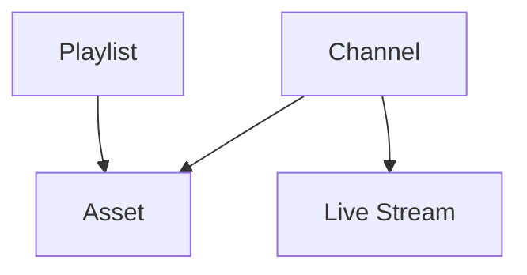

## Overview

Videograph provides four core building blocks for OTT workflows: assets for on-demand video, live streams for real-time input, channels for linear or FAST programming, and playlists for ordered collections of assets. These entities work together to form ingest, processing, and delivery pipelines that support both VOD and live scenarios.

<Callout kind="info" collapsed="false">
  This page introduces concepts only. For specific API endpoints, navigation, and parameters, see the API reference in the main Documentation tab.
</Callout>

## Entity relationships

The following diagram shows how the main entities reference each other.

### Summary of relationships

- Channels can reference assets and live streams to build a continuous schedule.

- Playlists group assets into a specific playback order.

- Assets are individual VOD items that may be generated from uploaded files or recordings from live streams.

- Live streams can create new assets when recordings are enabled.

## Assets (Video on Demand)

Assets represent processed on-demand videos. Each asset contains one or more encoded renditions optimized for delivery across devices and networks.

### Typical fields

- `id`

- `name`

- `description`

- `status` (for example, ingesting, processing, ready)

- `duration`

- `renditions`

- `createdAt` and `updatedAt`

### Common lifecycle operations

- Create an asset by uploading a file or converting a live stream recording.

- Update metadata, tags, or organizational attributes.

- Replace or add new renditions after re-encoding.

- Delete an asset to remove it from your VOD library.

- Publish its playback URL in your app or site.

<Columns cols="2">
  <Card title="Uploading & Ingesting Video" href="/vod-uploading-ingesting" icon="upload-cloud" horizontal="false">
    Learn how raw video files become ready-to-play assets.
  </Card>

  <Card title="Encoding Profiles & Renditions" href="/vod-encoding-profiles" icon="sliders" horizontal="false">
    Understand how configurable renditions shape playback performance.
  </Card>
</Columns>

## Live streams

Live streams represent ingest endpoints and active broadcast sessions. Their state determines what viewers see and what downstream services can use.

### Typical fields

- `id`

- `name`

- `status` (for example, idle, ingesting, live, ended)

- `ingestUrl`

- `playbackUrl`

- `recording` settings

- `createdAt` and `updatedAt`

### Common lifecycle operations

- Create a stream and retrieve ingest credentials.

- Begin ingesting to transition the stream to live status.

- Update stream metadata, ad insertion settings, or recording rules.

- Stop the broadcast to finalize the session.

- Delete a stream when no longer needed.

<Card title="Live Stream Basics" href="/live-stream-basics" icon="cast" horizontal="false">

</Card>

## Channels (Linear and FAST)

Channels create continuous, linear viewing experiences. A channel can mix VOD assets, live streams, and ad breaks to form a 24/7 or scheduled FAST-style output.

### Typical fields

- `id`

- `name`

- `status` (for example, building, ready, broadcasting)

- `schedule` or `playlistEntries`

- `output` URLs for HLS or DASH

- `createdAt` and `updatedAt`

### Common lifecycle operations

- Create a channel and define its schedule.

- Add assets, live streams, and ad slots.

- Adjust timings, replace entries, or roll a playlist forward.

- Publish or unpublish the channel feed.

- Delete the channel when retiring a linear stream.

<Callout kind="tip" collapsed="false">
  Channels rely on ready assets and active or scheduled live streams. Make sure inputs are in a valid state before publishing updates.
</Callout>

## Playlists

Playlists provide ordered groups of assets for on-demand playback. They can power episodic content, curated collections, or branded series.

### Typical fields

- `id`

- `name`

- `items` referencing asset ids

- `createdAt` and `updatedAt`

### Common lifecycle operations

- Create a playlist and add assets to it.

- Reorder items or update metadata.

- Remove items or retire the playlist.

<Card title="Metadata, Tags & Organization" href="/vod-metadata-tags" icon="tag" horizontal="false">

</Card>

## How these entities work together

- To build a VOD service: upload videos as assets, organize them into playlists, and integrate playback in your app.

- To power live events: create a live stream, broadcast to its ingest endpoint, and optionally convert recordings into assets.

- To launch a linear or FAST experience: create a channel that references your assets and live streams in a structured schedule.

<Columns cols="2">
  <Card title="Video Pipeline: Ingest, Process, Deliver" href="/core-video-pipeline" icon="layers" horizontal="false">
    Core pipeline overview for VOD and live workflows.
  </Card>

  <Card title="Overview of SSAI & FAST Channels" href="/ssai-fast-overview" icon="tv" horizontal="false">
    Learn how server-side ad insertion fits into linear channels.
  </Card>
</Columns>

