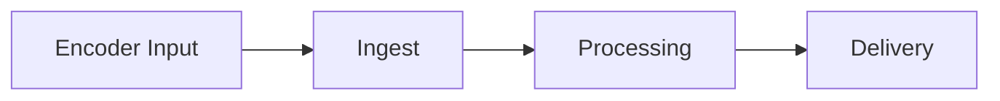

## Overview

Live monitoring in Videograph focuses on the real-time health of your end-to-end workflow. For on-call engineers and NOC teams, the objective is to detect issues early across encoder input, ingest stability, processing latency, and delivery performance. This page outlines the core signals to watch, common metrics surfaced in dashboards, and a concise pre-flight checklist to use before going live.

## Key metrics and signals

Each stage of the live pipeline produces signals that help you identify emerging issues before viewers are impacted.

### Encoder and input health

- Input bitrate stability
- Dropped or duplicated frames reported by the encoder
- Input video and audio format consistency
- Encoder CPU and network availability

### Ingest health

- Ingest bitrate compared to encoder output
- RTMP or other transport error rates
- Connection stability signals (reconnects, timeouts)
- Packet loss or jitter indicators

### Processing health

- End-to-end processing latency
- Rendition generation rate and stability
- Profile switching or fallback events
- Transcode error counts

### Delivery and viewer metrics

- Initial startup time
- Rebuffer ratio and frequency
- Player-side error rates
- Concurrent viewers and session drop-offs

<Callout kind="warning">

Always test failover paths, backup encoders, and redundant ingest endpoints before high-priority events. Early validation reduces the risk of mid-stream instability.

</Callout>

## Dashboards and alerts

Operational dashboards typically combine signals from encoders, ingest nodes, processing systems, and player analytics. While implementations vary, you should structure monitoring around the following categories:

- **Input quality:** sudden bitrate drops or format changes.
- **Ingest stability:** reconnects, protocol errors, increasing packet loss.
- **Processing latency:** spikes that correlate with quality or delivery degradation.
- **Delivery performance:** rising rebuffer rates, above-normal error codes, or regional delivery anomalies.

Alerts should trigger on thresholds that reflect your operational SLAs, such as input bitrate floors, ingest disconnect durations, processing latency bounds, or playback error-rate thresholds.

## Pre-flight checklist for going live

Use this short validation checklist before activating a live stream.

- Confirm encoder settings and stable upstream bandwidth.
- Verify ingest endpoint reachability and session stability.
- Validate processing profiles and rendition targets.
- Run a test playback from at least one internal device.
- Confirm backup encoder readiness and failover configuration.
- Ensure monitoring dashboards and alerting are active for the event window.