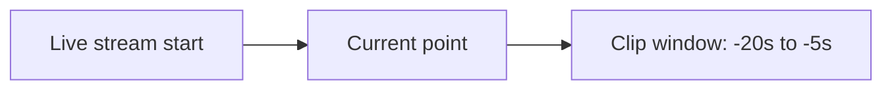

## Overview and use cases

Realtime clipping lets you create short video-on-demand assets from a currently running live stream. You define a time range, and Videograph cuts that segment and processes it as its own asset. This allows social and video teams to publish highlights, capture key moments, or create replay segments without waiting for the live event to finish.

Common use cases include:

- Social highlight moments during sports or events
- Instant replays for production or in-venue displays
- Quick-turn editorial clips that support news coverage
- Short assets for playlists, channels, or near-live publishing workflows

<Callout kind="info">

Realtime clips are treated as standalone assets. They maintain a link to the source live stream for traceability but follow the same lifecycle as any other VOD item.

</Callout>

## How realtime clipping works

Videograph supports clipping from a live stream using either:

- A time range relative to the live edge (for example, the last 20 seconds)
- An absolute timestamp window within the ongoing stream

After you define the window, Videograph retrieves that segment and processes it into a playable VOD asset.

### Example timeline

The diagram below shows a running live stream and how a clip can be defined relative to the live edge.

### Near-live windows

Clipping near the live edge depends on ingest and processing latency. Operators typically select a safe offset (for example, 5 to 10 seconds behind real-time) to ensure the segment is fully received and ready for extraction.

## Managing clips as assets

Clips created from a live stream behave like any other VOD asset in Videograph. They can be organized, tagged, modified, and published using the same workflows as described in the asset model overview in [Assets, Streams, Channels & Playlists](/assets-streams-channels-playlists).

### Asset metadata

You can:

- Add titles and descriptions that reflect the clipped moment
- Apply tags for categorization or later discovery
- Attach thumbnails, subtitles, or overlays as needed

### Publishing options

Clips can be:

- Embedded using the standard players described in [Players, SDKs & Embeds](/players-sdks-embeds)
- Scheduled in playlists or channels
- Exported to social platforms or downstream tools

## Operational tips for clipping during live events

### Understand end-to-end latency

The effective live edge is influenced by encoder buffer settings, network conditions, and ingest latency. Allow a small buffer when defining the clip start to ensure the underlying segment has been fully ingested.

### Coordination between operators

When multiple operators handle clipping:

- Agree on naming and tagging conventions
- Communicate clip timing to avoid duplicates
- Use workspace permissions from [Accounts, Workspaces & Roles](/accounts-workspaces-roles) to manage who can create or publish clips

### Verify clip completeness

Before publishing, quickly review the processed clip to confirm:

- The intended moment is included
- Audio and video are synchronized
- The clip starts and ends cleanly around the target action

<Callout kind="tip">

If you frequently create clips from similar types of events, consider preparing preset clip durations or workflow guidelines for your team to streamline operations.

</Callout>