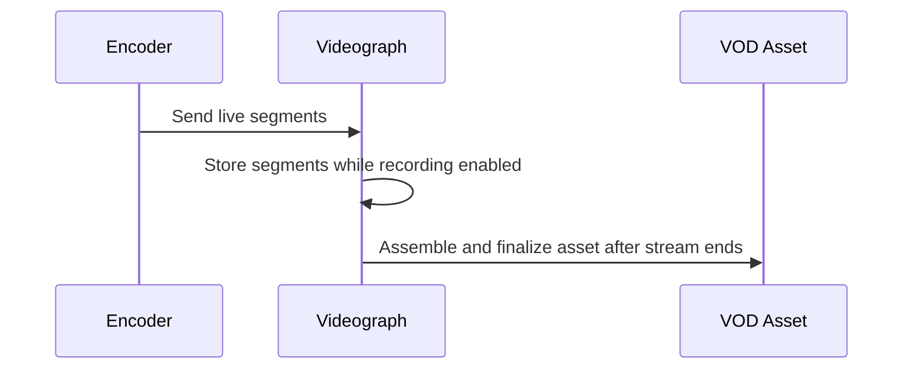

## Overview

Videograph can record an active live stream and automatically convert it into one or more VOD assets once the broadcast ends. When recording is enabled, the system stores incoming segments and assembles them into completed assets that pass through the standard VOD pipeline, including encoding, thumbnails, and metadata handling.

<Callout kind="info">

Recording is optional per live stream. You can turn it on when creating the stream or enable it before the broadcast begins.

</Callout>

## Enabling recording

To capture a live session for VOD, set the live stream's recording flag before the event starts. The setting applies for the entire session.

### Typical workflow

- Create or update a live stream with recording enabled.
- Begin ingesting your broadcast to the provided endpoint.
- Let Videograph segment and store the incoming media.
- End your broadcast normally; the asset is finalized automatically.

## From live session to asset

This timeline shows the path from live ingest to finalized VOD output.

### What happens during a session

- Segments are written continuously as long as recording is active.
- If your configuration targets multiple outputs, the system can produce multiple assets for the same session.
- After the live stream ends, Videograph joins segments, performs integrity checks, and sends the resulting asset into the VOD pipeline.

### Asset availability

Once finalized:

- The asset appears in your VOD catalog.
- It proceeds through the normal encoding workflow.
- Thumbnails, metadata, and organization tools behave exactly as they do for uploaded VOD.

## Post-processing and trimming

After the recording becomes a VOD asset, you can adjust it using standard VOD features. Common operations include:

- Updating title, description, and tags.
- Replacing or editing thumbnails.
- Creating trimmed edits or shorter cuts by processing the recorded asset with your existing VOD tooling.

<Callout kind="tip">

Trimming and segment-level edits occur *after* the asset is finalized, not during the live session.

</Callout>

## Common workflows

### Recurring shows

For repeating content (for example, weekly shows), enable recording on each live stream instance:

- Create a fresh live stream or reuse your configuration.
- Keep recording enabled.
- Each broadcast produces an independent VOD asset.
- Organize assets with tags or playlists to group episodes.

### Event capture

For conferences, matches, or one-off sessions:

- Enable recording on the event's dedicated live stream.
- Run the broadcast normally.
- Use post-processing to cut highlight reels or publish the full session.

### Multi-asset sessions

If your workflow needs separate assets for different segments of the same broadcast (for example, pre-show, main event, post-show):

- Configure your stream to create multiple outputs before going live.
- Videograph finalizes each asset independently after the live session ends.