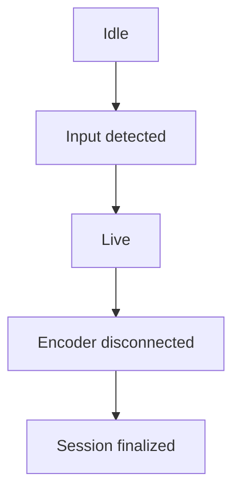

## Overview

A live stream in Videograph represents an ingest point that accepts real‑time media from an encoder and turns it into an HLS playback stream. You create the stream through an HTTP API, publish to the returned `rtmpUrl`, and play the resulting adaptive output from the `playbackUrl`.

<Callout kind="info" collapsed="false">
  You can safely prototype live streaming in a test workspace before configuring production ingest endpoints.
</Callout>

When you create a stream using the endpoint `POST /video/services/api/v1/livestreams`, you provide a title, a region, and a boolean `record` flag. The API responds with the ingest information your encoder needs: `rtmpUrl`, `streamKey`, `streamUUID`, `playbackUrl`, and an initial status of `Idle`.

## Creating a live stream

The minimal request requires three fields:

- `title`: A human‑readable name for the stream.

- `region`: A deployment region such as `us-east-1`.

- `record`: A boolean that determines whether Videograph records the session.

<Request show-lines="true" tabs={[]}>
  ```bash
  curl --request POST \
    --url https://api.videograph.ai/video/services/api/v1/livestreams \
    --header "accept: application/json" \
    --header "content-type: application/json" \
    --data '{ "title": "Live stream", "region": "us-east-1", "record": false }'
  ```
</Request>

<Response show-lines="true" tabs={[]}>
  ```json
  {
    "code": 200,
    "data": {
      "createdOn": 1673595417480,
      "metadata": [],
      "playbackUrl": "PLAYBACKURL",
      "rtmpUrl": "RTMP URL",
      "status": "Idle",
      "streamKey": "STREAMKEY",
      "streamUUID": "271dc169-da00-4f4e-bdc8-01c13f827eb9",
      "title": "live stream"
    },
    "message": "Livestream details with id: 271dc169-da00-4f4e-bdc8-01c13f827eb9",
    "status": "Success"
  }
  ```
</Response>

The returned ingest information is used directly by your encoder. You typically configure your encoder with the base RTMP server URL and supply the `streamKey` as the stream identifier.

The screenshots below show how streams created with recording turned on or off appear in the dashboard under the Live Recording and Live Stream menus.

<Image src="https://blob-cdn.documentation.ai/org-b713c195-07b6-46aa-b0f6-7e28b1a72b11/doc-dbecd5b1-e16f-4af5-9dff-ae113c6cd9de/1765361261485-3f1a3bvwgpl-image-aa.jpg?q=85&fm=auto&auto=compress%2Cformat" width="672" height="263" alt="" />

<Image src="https://blob-cdn.documentation.ai/org-b713c195-07b6-46aa-b0f6-7e28b1a72b11/doc-dbecd5b1-e16f-4af5-9dff-ae113c6cd9de/1765361334485-ulbhota2r7s-image-bb.jpg?q=85&fm=auto&auto=compress%2Cformat" width="672" height="260" alt="" />

## RTMP ingest URLs

Videograph exposes two RTMP ingest base URLs. The URL you use depends on the `record` parameter you set at stream creation time.

| Use case                                     | Base RTMP server URL                   | Behavior                                                                                 |
| -------------------------------------------- | -------------------------------------- | ---------------------------------------------------------------------------------------- |
| Recording enabled (`record` set to `true`)   | rtmp\://rc-ingest.in.videograph.ai/rec | Stream is recorded. Recorded content remains available for 12 hours from the start time. |
| Recording disabled (`record` set to `false`) | rtmp\://ingest.in.videograph.ai/live   | Stream is not recorded.                                                                  |

<Callout kind="tip" collapsed="false">
  Your encoder should publish to the base RTMP URL returned in `rtmpUrl` and append the `streamKey` exactly as provided.
</Callout>

## Playing the live stream

As soon as Videograph begins receiving valid media, it generates adaptive HLS output available at the `playbackUrl` returned during creation. You can embed this URL in any HLS‑compatible player or integrate it into your app.

You can also access the HLS playback URL directly from the Videograph dashboard.

<Image src="https://blob-cdn.documentation.ai/org-b713c195-07b6-46aa-b0f6-7e28b1a72b11/doc-dbecd5b1-e16f-4af5-9dff-ae113c6cd9de/1765361379451-utki8adi3un-image-f.jpg?q=85&fm=auto&auto=compress%2Cformat" width="672" height="303" alt="" />

For player integration guidance, see [Playing Videos (Web & App Integration)](/web-sdk-player).

## Understanding the live stream lifecycle

Immediately after creation, a stream is in an `Idle` state. When your encoder connects and begins pushing media, Videograph starts processing segments and updates the playback output. When the encoder disconnects, the system finalizes the session.

The dashboard shows the transition from Idle to Active when streaming starts and provides controls to stop the session.

<Image src="https://blob-cdn.documentation.ai/org-b713c195-07b6-46aa-b0f6-7e28b1a72b11/doc-dbecd5b1-e16f-4af5-9dff-ae113c6cd9de/1765361358212-c0cx4jtaseq-image-dd.jpg?q=85&fm=auto&auto=compress%2Cformat" width="672" height="308" alt="" />

<Image src="https://blob-cdn.documentation.ai/org-b713c195-07b6-46aa-b0f6-7e28b1a72b11/doc-dbecd5b1-e16f-4af5-9dff-ae113c6cd9de/1765361390713-9xbjmxfivqh-image-g.jpg?q=85&fm=auto&auto=compress%2Cformat" width="672" height="300" alt="" />



This simplified flow captures the high‑level transitions relevant for most integrations.

## Next steps

To learn how to publish video, enable recording, and work with the resulting outputs, continue with the detailed guide: [Creating, Streaming & Recording Live Sessions](/live-recording-vod).
