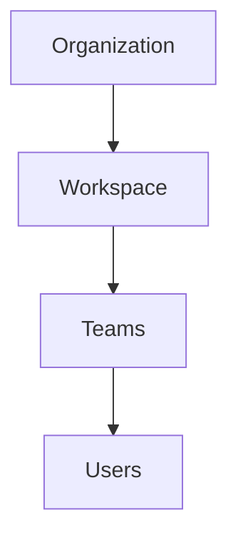
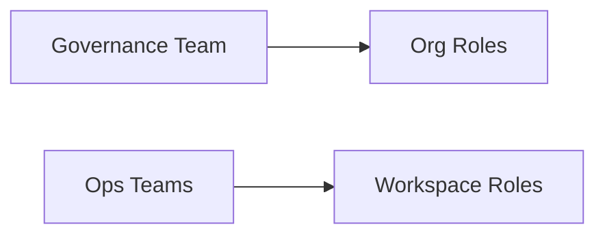

## Overview

Videograph structures account-wide management around **organizations**, which contain one or more **workspaces**. This hierarchy lets you align access and governance with how your company manages brands, regions, or clients. Teams or groups inside an organization can receive roles at both organization and workspace levels, giving you flexible control without duplicating users or credentials.

Workspaces are documented in detail in [Accounts, Workspaces & Roles](/accounts-workspaces-roles). This page focuses on how organizations and teams fit together and how permissions differ across scopes.

## Hierarchy: organization → workspaces → teams

The core hierarchy follows a simple pattern grounded in Videograph&nbsp;structure:

- **Organization**  
  The top-level account. Central place for billing ownership, global settings, identity management, and high-level governance.

- **Workspaces**  
  Each organization can contain one or many workspaces. Workspaces group content, configuration, and environment-specific settings such as staging, production, or per-brand separation.

- **Teams or groups**  
  Teams gather users into manageable units. You can grant teams roles either at the organization level or workspace level. This reduces repetitive user setup and keeps permissions aligned with real-world structure.

## Roles and permissions

Videograph supports scoped permissions at two layers:

### Organization-level roles

Organization-level roles apply broadly across all workspaces. Typical high-level responsibilities include:

- Managing billing and account-wide settings.
- Creating, archiving, or renaming workspaces.
- Inviting or removing users and managing teams.

You can assign teams or individual users to these roles to centralize ownership and governance.

### Workspace-level roles

Workspace-level roles apply only to a specific workspace. These commonly represent operational tasks such as:

- Uploading, modifying, or deleting video assets.
- Managing live streams, encoders, or schedules.
- Configuring players, metadata, or delivery policies.

Exact role names may vary, but most organizations use combinations of **admin**, **editor**, and **viewer** style permissions depending on responsibility.

<Callout kind="tip">

Start with restrictive defaults. Grant teams the minimum set of permissions they need at the organization level, and expand access only at individual workspaces when required.

</Callout>

## Common patterns for multi-brand or multi-region setups

Different organizations structure their workspaces and teams according to business model, scale, and compliance needs.

### Single organization with many workspaces

A unified organization often includes workspaces aligned to environments, product lines, divisions, or brands. A common setup:

- One shared **admin** or **platform** team at the organization level.
- Separate **editor** teams for each workspace.
- Optional **viewer** teams for analytics or QA.

### Agencies or service providers managing client workspaces

Agencies typically create one organization and allocate each client to its own workspace:

- Agency-wide administrators handle organization-level tasks.
- Workspace-specific client teams receive editor or viewer permissions only within their assigned workspace.
- Ensures clear separation between client content and analytics.

### Regional or compliance-driven separation

Companies operating across regulatory boundaries often require strict data and access segmentation:

- Independent workspaces for each region or compliance zone.
- Local operations teams assigned editor roles in their region only.
- Central compliance or security teams hold organization-level governance roles.

## Governance best practices

To maintain predictable, auditable access control:

- Prefer **team-based** assignments rather than granting roles to individuals.
- Separate **governance** (billing, identity, compliance) from **operations** (content, streaming, publishing).
- Use workspace boundaries to enforce environment separation or isolation duties.
- Review team membership and permissions periodically, especially after reorganizations.
- Document ownership for every workspace to avoid unmaintained or orphaned environments.

